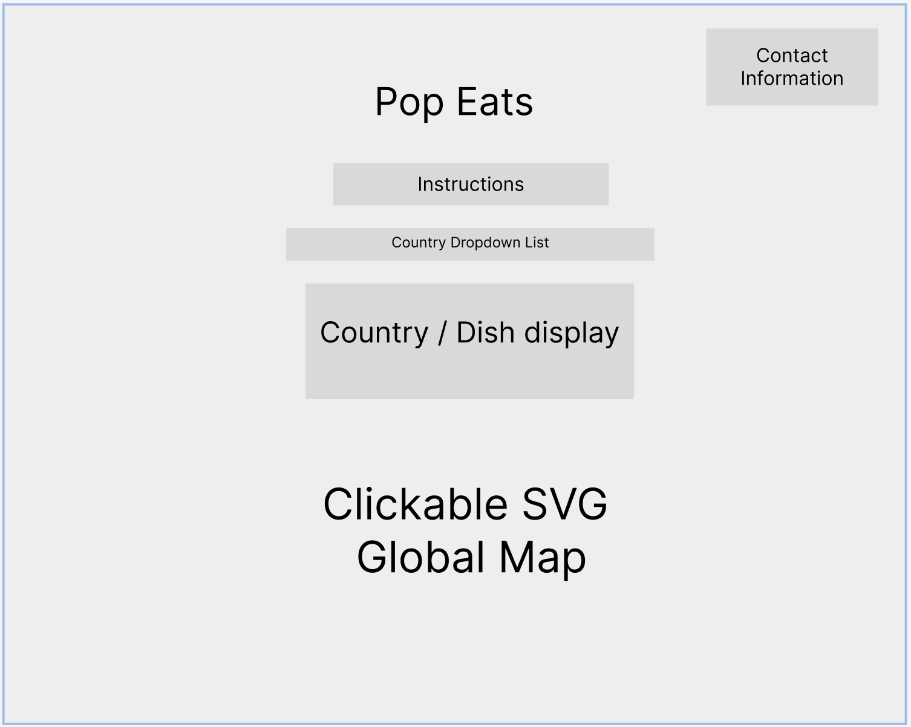

# :plate_with_cutlery: Pop Eats 

## Background

The world is diverse in many different ways, but one thing that every country has in common is food. Food is a comfort that can bring a community to the table, and with the mix of different spices, textures and flavors, each country has been able to take staples from their respective lands and turn them into a dish that many from that country and even around the world enjoy.  Pop Eats is an interactive visual web application where the user will be able to click on each country and determine what the national dish / most popular dish is.  The goal for this project is to spread the love of food and curiosity of culture and diversity to others. And to maybe even find a fun new dish to try!

[Live Link](https://lavparker.github.io/pop_eats_latest/)

## Functionality & MVPs

In Pop Eats, users will be able to:

- Click on the instructions button to view instructions on how to use the app
- Select a country on a map and view the national dish of that country
- Use a dropdown to search for a country and view the national dish of that country

## Wireframes




## Technologies, Libraries, APIs

This project will be implemented with the following technologies:
- ```Vanilla JavaScript``` for overall structure and logic
- ```D3.js``` for DOM manipulation and rendering
- ```Webpack``` to bundle and serve up the various scripts
- ```npm``` to manage project dependencies
- ```REST Countries API``` to get the country data
- ```Wikipedia API``` to get the national dish data

## Implementation Timeline

My timeline is as follows:

### Friday/ Weekend:

- Draw out a visual map for my desired result including hover features and facts that I want to display. Gather information, from APIs and libraries that are of interest and determine realistic day by day expectations in order to complete and optimize this project. Begin researching countries and laying frameworks.

### Monday/ Tuesday:

- Build interface/ front end capabilities that engage event listeners, hovering, drag and drop and overall HTML/ CSS for user visualization. Begin back end.

### Wednesday/Thursday,

- Build out back end and include the country dishes, facts and if there is time flags once hovered over the country.

## Bonus Features

- Add a flag to each country that can be hovered over to view the national dish of that country
- Add a link to the national dish that will take the user to a recipe for that dish
- Add a link to the country that will take the user to a Wikipedia page for that country


## Credit

- By Canuckguy et al. - Based on BlankMap-World.svg, Public Domain, https://commons.wikimedia.org/w/index.php?curid=3227969

- (SVG Map: https://cdn.jsdelivr.net/npm/world-atlas@2/countries-110m.json)

- (National Dish Data: https://raw.githubusercontent.com/samayo/country-json/master/src/country-by-national-dish.json)

- A special thanks to the TAs and coaches at App Academy for their help and guidance throughout this project. 
